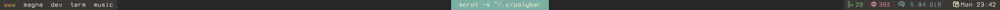

# Polybar Configuration

This repository contains my configuration for Polybar, a lightweight and highly customizable status bar for Linux.

### Installation

- Make sure you have Polybar installed on your system.
- Clone this repository to your preferred location on your system.
- Copy the configuration files from the repository to the Polybar configuration directory on your system. This directory is typically located at ~/.config/polybar/.
- Make sure to modify the configuration files to suit your preferences and system setup. This includes changing the fonts, colors, modules, and any other relevant settings.
